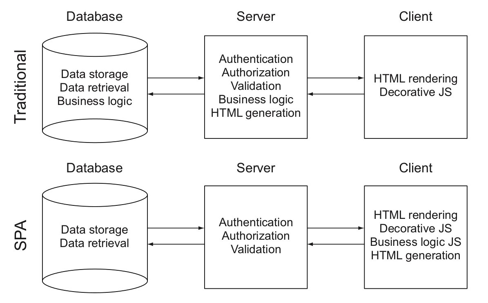

# Características y arquitectura de un SPA

Por SPA se conocen las aplicaciones de una sola página o **Single Page Applications**. La aplicación se envía al navegador y la página no se recarga durante el uso de la aplicación.

Una aplicación con esta arquitectura podría realizar cualquier función que desarrolle una aplicación tradicional de escritorio ya que el tiempo de respuesta es mucho más rápido que el de una aplicación web tradicional.

En cuanto a la arquitectura de la aplicación, la mayor parte de la funcionalidad se lleva al cliente. Lo podríamos ver como un fat-client que se carga desde un servidor web. El código en servidor se usa básicamente para proveer de una API RESTful a nuestro código cliente usando Ajax.

## Un poco de historia

### Plataformas SPA

- Las tres plataformas de SPA más utilizadas (2014) son Java applets, Flash/Flex y JavaScript.
- La mejor elección es JavaScript por las siguientes razones:
  - No necesita ningún plugin ni ninguna configuración de seguridad adicional.
  - Utiliza menos recursos que introducir otro entorno de ejecución adicional.
  - Una página más fluida e interactiva: la interfaz de la aplicación es la ventana completa del navegador
- Por contra JavaScript ha tardado en ser competitivo principalmente por las inconsistencias entre los distintos navegadores.

### SPA vs app tradicional
- Si comparamos un SPA con desarrollos de aplicaciones de escritorio tradicionales, podemos ver como también hay numerosos puntos a favor de JavaScript:
  - El navegador es la aplicación más utilizada del mundo, ejecutar un SPA es tan sencillo como hacer un clic en una entrada en la barra de favoritos. El despliegue de la aplicación también es trivial
  - Es una solución multiplataforma
  - JavaScript se ha vuelto extremadamente rápido gracias a la competencia entre los distintos navegadores

  - La propia evolución de JavaScript con el uso de JSON, jQuery, AJAX y muchas librerías actuales y potentes.
  - Podemos utilizar JavaScript tanto en servidor como en cliente mediante Node.js.
  - Existen bases de datos que pueden comunicarse directamente en JSON como CouchDB o MongoDB
  - Dadas las ventajas inherentes a JavaScript hay herramientas para trabajar en otros lenguajes de programación y que generan posteriormente JavaScript. Un ejemplo es Google Web Toolkit (GWT) que genera JavaScript desde Java o Cappuccino que utiliza Objective-C.

### Problemas de JavaScript
- Sin embargo por la naturaleza de un SPA teníamos varios inconvenientes (entre paréntesis cito posibles soluciones):

  - En JavaScript no hay namespaces (solucionado en ES6)
  - El tipado es débil (existen soluciones como [Facebook flow](https://github.com/facebook/flow) o TypeScript)
  - Enrutamiento en cliente (múltiples soluciones vía framework o vía librerías)
  - Código html extenso (no mediante web components)

## Frameworks de JavaScript

- El uso de frameworks y en especial la aparición de Angular en 2013 y su gran adopción en la comunidad de desarrolladores supuso un fuerte empujón en la facilidad para implementar un SPA mediante JavaScript. Desde entonces han aparecido una gran cantidad de frameworks y se extiende el concepto *JavaScript fatigue*:

> Saul: How’s it going?
> 
> Me: “Fatigued.”
> 
> Saul: “Family?”
>   
> Me: “No, Javascript.”

- Al final del 2015, muchas empresas quitaron o anunciaron que iban a eliminar el soporte a tecnologías como Flash, Silverlight o Java de sus navegadores. 
- Oracle propone a los desarrolladores de Java migrar sus applets a Java Web Start.

## Avances en JavaScript 
- Las nueva versión de JavaScript (ES2015) ha mejorado muchas carencias del lenguaje como el uso unificado de módulos.

- Se implementan soluciones para el tipado de datos, ya sea programando en lenguajes intermedios como TypeScript o mediante soluciones como [Flow](https://github.com/facebook/flow).

- El uso de Polymer o React.js marca la tendencia a trabajar hacía web components. Angular 2, después de mucho tiempo el 2 de Mayo de 2016 publicó su Release Candidate.

- React.js fue la gran revelación en el 2015 y parece que ha surgido para quedarse. Ya veremos que ocurre con Angular2, hay quien dice que llega demasiado tarde....

