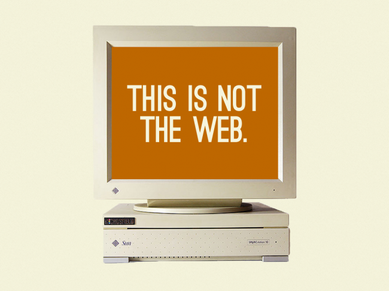
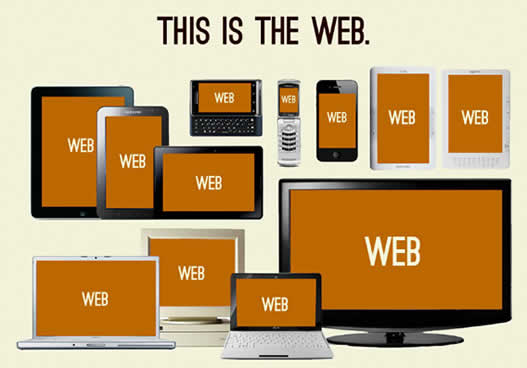
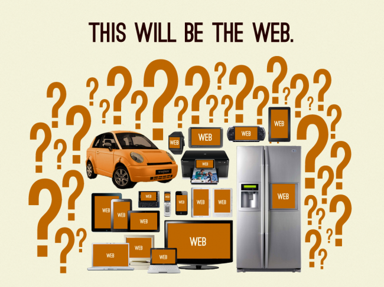
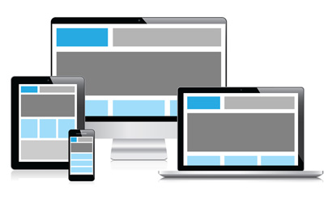
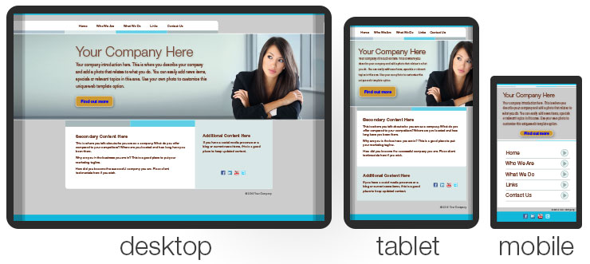
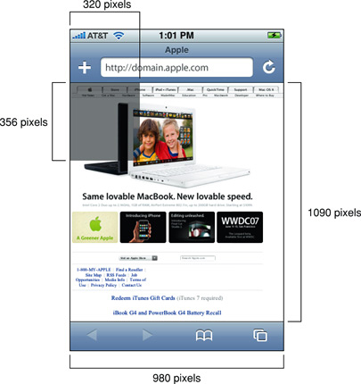
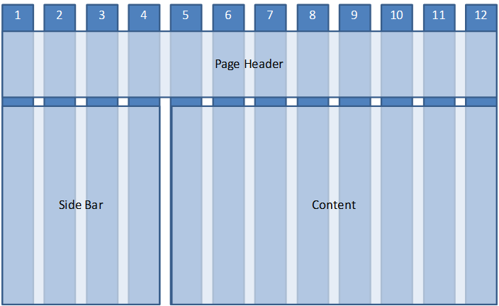
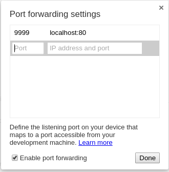

# Introducción

## Como era la web

    
## La web en la actualidad
Accesible desde cualquier dispositivo o entorno

    
## La web en el futuro
Siguiendo el [principio de universalidad](http://www.cs.virginia.edu/~robins/Long_Live_the_Web.pdf)

## La web para móviles

- Por donde empezar 
    - <https://developers.google.com/webmasters/mobile-sites/>
    - [Curso gratuito Udacity, de Google](https://www.udacity.com/course/cs256)
- Oportunidades de negocio
    - [Google da más ranking (SEO) para búsquedas desde móviles a las webs con diseño específico para móviles](http://googlewebmastercentral.blogspot.co.nz/2015/02/finding-more-mobile-friendly-search.html) (a partir de Abril 2015)
    - [Comprueba si una web está optimizada para móviles](https://www.google.com/webmasters/tools/mobile-friendly/) 

## ¿Dos versiones para una sola web?
- Es facil que pierdan sincronización
- [No siempre está claro cuando hay que servir la versión móvil y cuando la desktop](http://detectmobilebrowsers.com/)
- Toda la información tiene que estar disponible en ambos tipos de webs
- Mayor trabajo para el desarrollador
- Google defiende el uso de una sola versión para todos los dispositivos

## Consideraciones versión movil
- **Usabilidad**
    - El usuario puede acceder también a la versión desktop, especialmente si esta última tiene más funcionalidad
    - La redirección a la versión desktop se debe hacer entra páginas, no al nivel principal de la web.
- **SEO**
    - Debemos evitar [contenido duplicado](http://www.copyscape.com/)
    - Hay que [poner la URL Canónica en los meta](https://developers.google.com/webmasters/mobile-sites/mobile-seo/configurations/separate-urls?hl=es).
        - Desde la versión para PC:
        
        ~~~
<link rel="alternate" media="only screen and (max-width: 640px)"
      href="http://m.example.com/page-1" >
        ~~~

        - Desde la versión para móviles:

        ~~~
<link rel="canonical" href="http://www.example.com/page-1" >
        ~~~

## Un solo diseño antes
- **Layout fluido**:
    - La web se adaptaba al dispositivo
    - Útil al existir pantallas de PC con distintas resoluciones y formatos

## Un solo diseño ahora
- **Diseño adaptativo**:
    - Los elementos de la web se adaptan (recolocan) mediante CSS en función del tipo de dispositivo.
        - Menú arriba en vez de lateral
        - Texto y todos a distinta altura
- **Diseño responsivo**:
    - Diseño adaptativo y fluido
   

# viewport

## ¿Qué es el viewport?
- [Etiqueta meta introducida por Apple](https://developer.apple.com/library/safari/documentation/AppleApplications/Reference/SafariWebContent/UsingtheViewport/UsingtheViewport.html), y luego adoptada y desarrollada más allá por otros.
- Se traduce como ventana gráfica
- Indica al navegador cómo ajustar la página web para verse en el terminal: 
    - El terminal "miente" sobre el tamaño de su pantalla
    - Realiza escalado
    - ...
    
~~~
<meta name="viewport" content="width=980">
~~~

- Dentro del atributo content se pueden colocar múltiples valores delimitados por comas. 

## Páginas para ordenadores en dispositivos móviles
- Cuando no se especifica una ventana gráfica en una página, los navegadores para móviles mostrarán esa página con un ancho alternativo que irá desde los 800 hasta los 1024 píxeles CSS. 
- El factor de escalado de página se ajusta de modo que la página quepa en la pantalla, lo que obliga a los usuarios a hacer zoom para interactuar con la página.

## Necesidad del viewport

- Para compatibilidad/usabilidad con los sitios web, los iPhone pedían una ventana gráfica de 980px.

## Píxeles
- **Píxel de hardware**: píxel físico en la pantalla.
- **Píxel independiente del dispositivo (dip)**: 
    - Escalado de los píxeles del dispositivo para que coincidan con un píxel de referencia uniforme a una distancia de visualización normal. 
    - [El tamaño debería ser aproximadamente el mismo en todos los dispositivos](http://cssmediaqueries.com/target/) 
- **Pixel CSS**: 
    - Unidad utilizada en el diseño de página que controla la ventana gráfica. 
    - Las dimensiones en píxeles incluidas en estilos como *width: 100px* se especifican en píxeles CSS. 
    -  La proporción entre píxeles CSS y píxeles independientes del dispositivo constituye el factor de escalado de la página o el zoom.

## window.devicePixelRatio 
- Los dispositivos aumentan su resolución (píxeles) pero [su **device-width** y **device-height** no cambia](http://cssmediaqueries.com/target/)
- Aumenta su devicePixelRatio
    - Densidad de píxeles
    - Número aproximado de píxeles físicos en el dispositivo por cada dip.
- La resolución del dispositivo no es la misma que el viewport del dispositivo
- La resolución será mayor, es lo que Apple llamó **Retina Display**

## Configuración habitual de nuestro viewport
- Hay multitud de dispositivos
    - Aparecen "bugs" o comportamientos distintos entre los fabricantes
    - No podemos realizar un viewport específico para cada dispositivo (targets)
        - Salvo que funcione bien en todos los dispositivos móviles menos en el de tu jefe :-(
        - 
- Utilizaremos html5 boilerplate
    - Opción custom: <http://www.initializr.com/>
    
    ~~~
<meta name="viewport" content="width=device-width, initial-scale=1">
    ~~~
    
## Propiedad initial-scale

~~~
<meta name="viewport" content="width=device-width, initial-scale=1">
~~~

- Valor por defecto 1
- Normalmente no la tocaremos

- ¿Por qué lo indicamos?
    - Escenario: Giramos un iOS de modo vertical (portrait) a modo apaisado 
    - Comportamiento: iOS mantiene la anchura que tuviese, y utiliza zoom para llenar la nueva anchura.

## Más zoom
- Otras propiedades:
    - minimum-scale
    - maximum-scale 
    - user-scalable
- Se suelen utilizar tan solo en aplicaciones web embebidas.
- Eliminar la posibilidad del zoom limita la accesibilidad.

# Media Queries

## Hasta CSS3

- Utilizamos media types, que ¡Siguen siendo útiles!
- Podemos modificar los estilos de las páginas en función del medio donde se visualiza.
- Limitación: 
    - media="handheld" no es suficiente. 
    - ¡Hay demasiados tipos de móviles!

~~~
/*mediante css:*/
@media print {
  body { font-size: 10pt }
}
@media screen {
  body { font-size: 13px }
}
@media screen, print {
  body { line-height: 1.2 }
}
~~~
  
~~~
<!--Mediante html:-->
<link rel="stylesheet" href="basico.css"  media="screen"  />
<link rel="stylesheet"  media="print" href="especial.css" />
<link rel="stylesheet"  media="handheld" href="mobile.css" /> 
~~~

## Media Queries
- CSS3 introduce las media queries

~~~
@media <media-query> {
  /* media-specific rules */
}
~~~
  
- Pueden utilizar operadores lógicos: not, and, only...
 
~~~
@media screen and (min-width: 1024px){
  /*css para pcs*/
}
~~~

- Lista separada por comas
    - Actua como un operador OR
    - Para dispositivos con un ancho desde 700px ó móviles en apaisado:
 
~~~
        @media (min-width: 700px), handheld and (orientation: landscape)
         { ... }
~~~

# Fluid Layout

## Unidades de medida
- Trabajaremos en ems, rems, porcentajes...
- Un diseño fluido soluciona el problema de adaptar nuestra web a distintos tamaños de pantalla (problemática anterior a los móviles)
- Configuramos el font-size del navegador en 16px para el navegador
- Así la conversión de px a ems sea sencilla: 1em = 10px;

~~~
<h1>
   Título de mi página web <a href="#">y enlace a otro sitio</a>
</h1>
~~~

~~~
html {font-size: 16px;}
body {
  font-size: 62.5%; /*1em = 10px*/
}
~~~

## Conversión pixels a ems

~~~
h1 {font-size: 30px;
    font-weight: bold;}
h1 a {font-size: 14px;}
~~~

~~~
h1 {font-size: 3em; /* 30px/10px */
    font-weight: bold;}
~~~

- ¿Como sería el css para el font-size del selector **h1 a**?

~~~
h1 a { font-size: 0.46666667em; /* 14px/30px */}
~~~

## Formula para convertir px a ems
- **objetivo / contexto = resultado**
- El objetivo es el elemento en el que queremos cambiar "la medida"
- El contexto normalmente será el elemento container
- Para un padding, por ej. el contexto será el propio elemento (propiedad width)
- Para un border en cambio, el contexto será el elemento container

## Inconvenientes de ems

- De cálculo:

~~~
12px (target) / 14px (context) = 0.857142857em (result)
~~~

- Es facil confundir el context cuando tratas con elementos anidados:
    - El heading en el main tendrá un valor distinto al heading del sidebar si sus containers tienen diferentes valores em.
    - Hay que definir más valores y es fácil confundirse.  

## Unidades rem 
- root em = rem
- El context es siempre el font-size del elemento raíz
- Los calculos pueden ser más fáciles 
    - Hacemos 1em = 10px
    - La proporción anterior nos sirve para cualquier elemento

## Unidades relativas al view port

- Otra opción es utilizar una medida relativa al view port (sirve también para PC's)

~~~
1vw = 1% of viewport width
1vh = 1% of viewport height
1vmin = 1vw or 1vh, whichever is smallest
1vmax = 1vw or 1vh, whichever is largest
~~~

- Con esta opción es muy facil crear un botón que ocupe 1/3 de la pantalla:

~~~
button { width: 33vmin; height: 33vmin;}

~~~

## Grids
- Normalmente para colocar los elentos en nuestra página utilizaremos rejillas o grids
- Nos basaremos en grids fluidos: 
    - Todas las columnas de la misma anchura
    - La anchura será variable
    

- Testing redimensionando la ventana del navegador.

## Display flex

- Colocar elementos de 1 en 1 mediante filas o columnas flexibles
  - [Ver soporte actual en los navegadores](http://caniuse.com/#search=flexbox)
- [Guía para utilizar flexbox](https://css-tricks.com/snippets/css/a-guide-to-flexbox/)

~~~
{display: flex;}
~~~

# Responsive Web Design

## Diseño adaptativo

- Normalmente un diseño fluido no es suficiente
- A menudo habrá que plantearse un **diseño diferente para distintos dispositivos**
   - Normalmente consideraremos al menos **3 escenarios: móviles, tabletas y PCs.**
   - Generaremos unas **hojas de estilo específicas** para cada escenario
- Mejoraremos la **experiencia de usuario**:
    - Evitar líneas de texto excesivamente largas
    - Guardar proporciones en video en formato 16/9 o en imágenes para modos portrait y landscape puede condicionar mucho el resto del layout. 

## Medios para conseguir un diseño adaptativo
- Optamos por un sitio web diferente para cada tipo de dispositivo
   - [Agente de usuario](http://detectmobilebrowsers.com/)
- Optamos por un css diferente para cada tipo de dispositivo ()
   - **Media Queries**, a partir de break points o puntos de ruptura

- Actualmente es preferible un único sitio web (diseño adaptativo) que se adapta a los dispositivos
   - Mejor para el cliente (SEO)
   - Mejor para el desarrollador (menos trabajo)
   - Mejor para Google

## Breakpoints

- Cambiaremos la disposición de ciertos elementos html en función del dispositivo, resolución...
  - Normalmente se hace en función de la anchura del viewport.
  - Hay dispositivos con la misma anchura en pixeles pero distinta densidad de píxeles
  - Estos puntos de ruptura se definen mediante media queries

## Criterio Mobile First
- En los dispositivos móviles tenemos menos espacio de pantalla que en un PC
- Existe una **filosofía Mobile First**: centrarse en lo que es verdaderamente importante para el usuario:
en los dispositivos móviles por lo que:
   - Se simplifica el contenido
   - Se prioriza el layout
   - Se optimiza la experiencia de usuario
- Diseñamos primero para móviles, y luego para el resto.

## Diseño responsivo
- Juntamos un diseño fluido con un diseño adaptativo
- Para cada perfil de dispositivos (móviles, tablets, pcs) habrá distintas pantallas
   - Diseño fluido para cada tipo de dispositivo
   - Nuestro contenido es el que define los breakpoints
   - Solución universal
- El creador del término fue *Ethan Marcotte* en su artículo [Responsive Web Design](http://alistapart.com/article/responsive-web-design), [ver traducción](http://xn--diseowebresponsive-q0b.org/)

# Imágenes y Video

## Imágenes
- No deben tener tamaño fijo
- No queremos que salgan de su elemento contenedor:

~~~
img {
max-width: 100%;
}

~~~

## Imagenes
- Retina Display
    - Nombre dado por Apple a pantallas con una densidad mayor de lo habitual
    - Nos harán falta  imágenes con una densidad de píxeles mayor (1,5x-2x)
	- Imágenes mayores (1,5x a 2x) = Tiempos de carga mayores
	- Habrá que cargar este tipo de imágenes tan solo cuando sea necesario
	- Se suelen nombrar con un sufijo "@2x", antes de la extensión.
    - Ojo, también los iMac tienen pantalla retina, no es cosa solo de móviles

- Tendremos que distinguir entre:
    - Imágenes de contenido (mediante la etiqueta img)
    - Imágenes decorativas (mediante CSS)

## Imágenes de contenido
- Podemos utilizar el atributo srcset, pero [no es una solución universal](http://caniuse.com/#feat=srcset)
- Si el navegador no lo entiende, utilizará el atributo src :-)

~~~

~~~

- Otra opción es [utilizar un polyfill](http://scottjehl.github.io/picturefill/)

- Información detallada: <http://demosthenes.info/blog/944/Responsive-Images-For-Retina-Using-HTML5s-srcset>

## Imágenes decorativas
- .box de 200px con una imagen de fondo (200x200):

~~~
.box{
    background:url('images/box-bg.png') no-repeat top left;
    width:200px;
    height:200px
}
~~~

- Utilizaremos otra imagen de tamaño mayor (400x400)
- Recuerda que la "," actua como operador OR

~~~
@media
only screen and (-webkit-min-device-pixel-ratio: 2),
only screen and (   min--moz-device-pixel-ratio: 2),
only screen and (     -o-min-device-pixel-ratio: 2/1),
only screen and (        min-device-pixel-ratio: 2),
only screen and (                min-resolution: 192dpi),
only screen and (                min-resolution: 2dppx) { 
 .box{
        background:url('images/box-bg@2x.png') no-repeat top left;
        background-size: 200px 200px;
    }
}
~~~

- **Background-size** para insertar la imagen de 400px en 200px.

# Debug desde el movil

## Configuración del movil
- La configuración siguiente puede cambiar en función del dispositivo :-(
- Activamos el modo desarrollador:
   - Vamos a ajustes / Información del teléfono 
   - Pulsamos en *número de compilación* al menos 7 veces
- Aparece un nuevo item en el menú de Ajustes, *Opciones de Desarrollo*
- Activamos la opción Depuración USB

## Uso de las dev tools
- Necesitamos una **versión actual de Chrome** tanto en el PC como en el movil
- Abre la url para depurar en el **navegador Chrome** de tu movil
- Abre la url **chrome://inspect** en el PC
- Conectamos mediante cable USB un movil Android al PC
- Aceptamos la clave RSA para el debug desde el ordenador (solo hará falta una vez, luego ya tendremos la clave de este PC)
- Ya podremos debugear desde la ventana de Chrome del PC

## Reverse Port Forwarding
- Si queremos hacer un debug de un sitio web colgado en nuestro PC, deberemos hacer un port forwarding
- Habilitaremos un puerto en el movil que se redireccionará al puerto local del servidor web
 

- En este caso, desde el navegador mediante http://localhost:9999 conectaré al puerto 80 del PC

